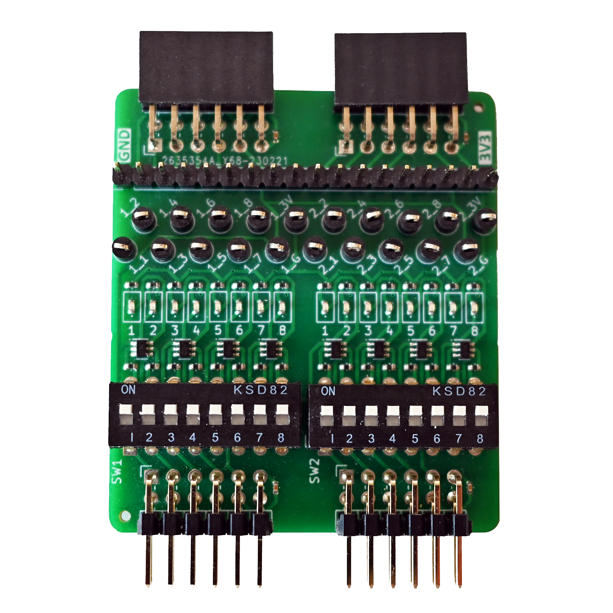
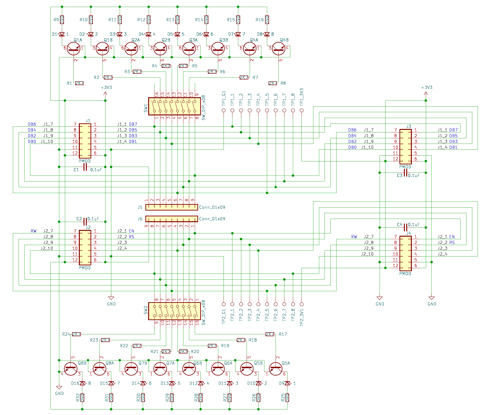
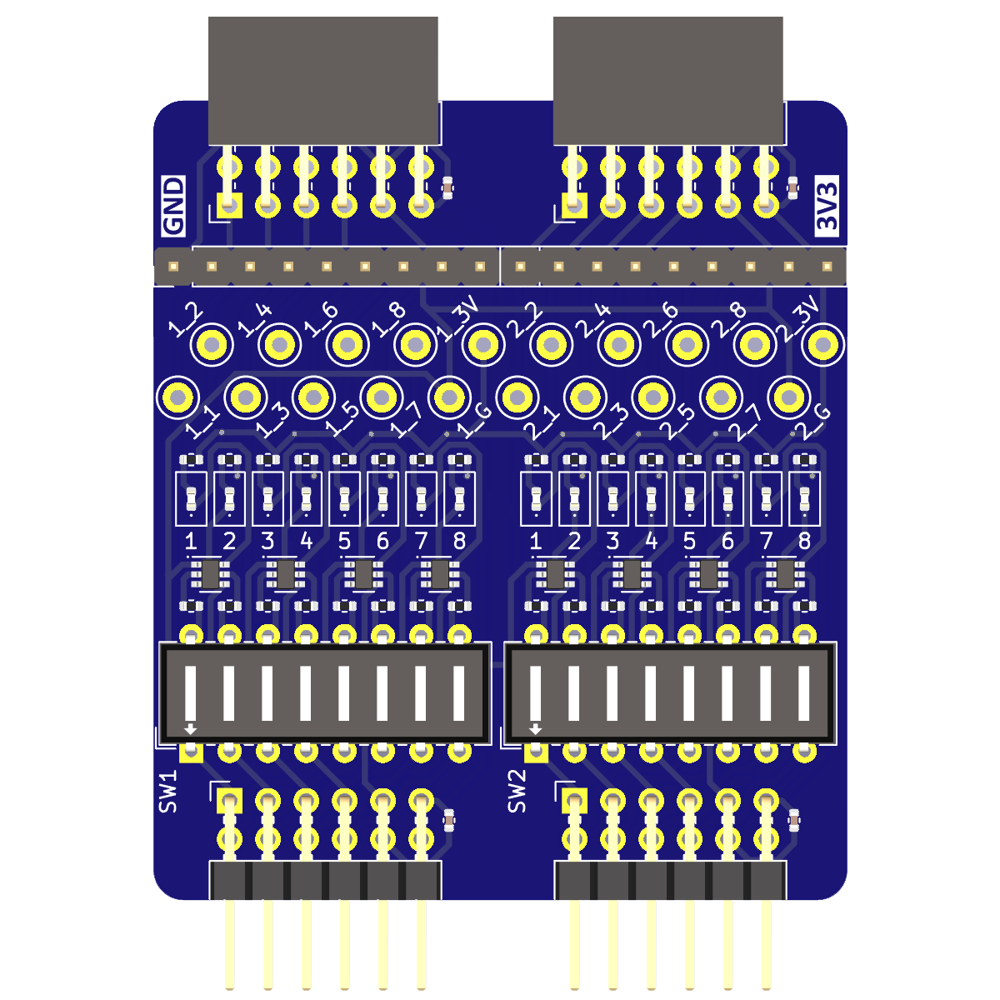
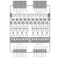
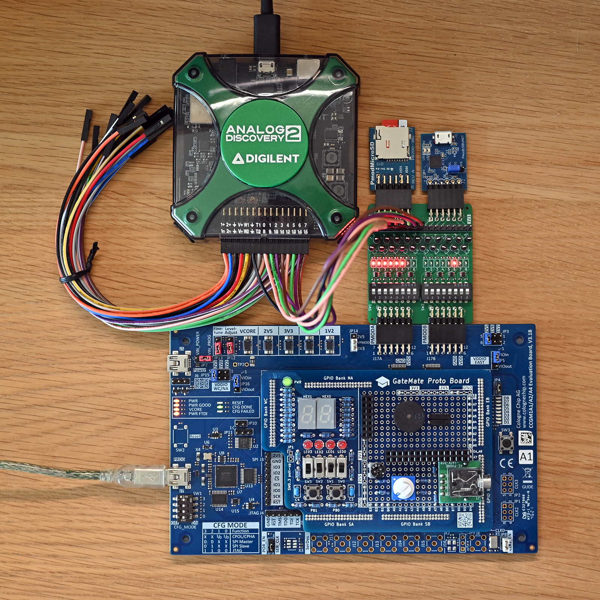

## PMOD Analyzer

### Description

The PMOD Analyzer implements a twin-connector, pass-through PMOD board that routes 2x8 I/O signals from pinheader to pinsocket with breakout into a 18-pin 2.54mm header row for connecting protocol analyzers, and 20 test points for mini-grabber hook-ups that are useful for oscilloscope measurements. Lastly, each signal can be individually switched on to drive a control LED on each I/O line. This makes it ideal for troubleshooting by inserting it between a controller board and PMOD peripherals. With the LEDs switched on, the PMOD can operate "standalone" as a normal LED output board.

http://fpga.fm4dd.com/

### Schematic

### PCB Gerber

| Version | Gerber | Schema |
|---------|--------|--------|
| 1.0     |[20230218-pmod-analyzer-gerber.zip](fabfiles/v10/20230218-pmod-analyzer-gerber.zip) | [20230218-pmod-analyzer-schema.pdf](fabfiles/v10/20230218-pmod-analyzer-schema.pdf) |

### Board Pictures

PMOD Analyzer, connected to the Gatemate E1 FPGA board.

